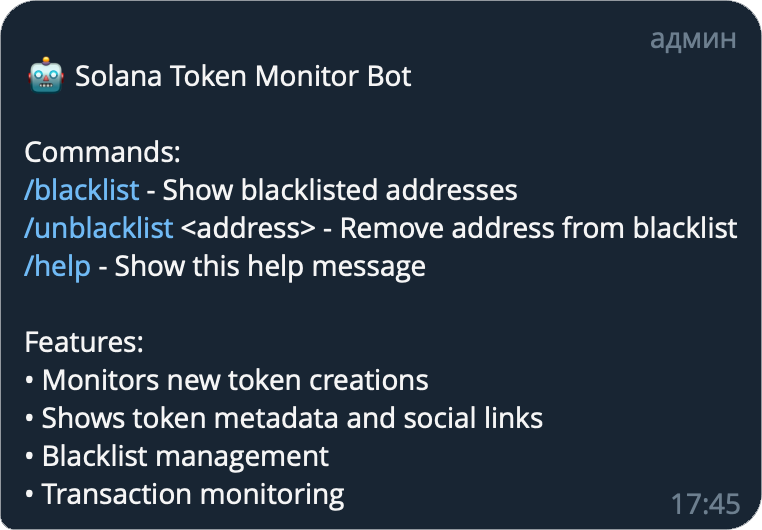
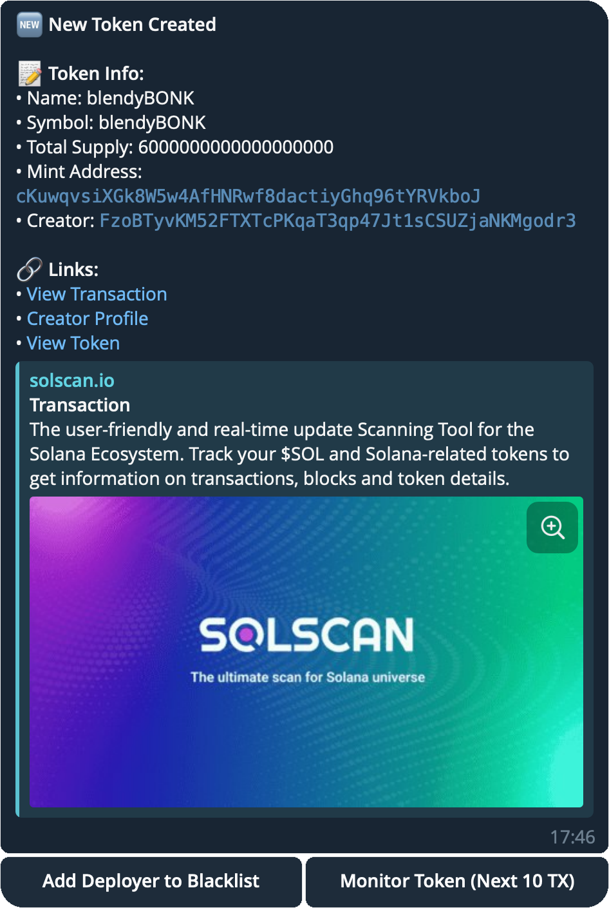
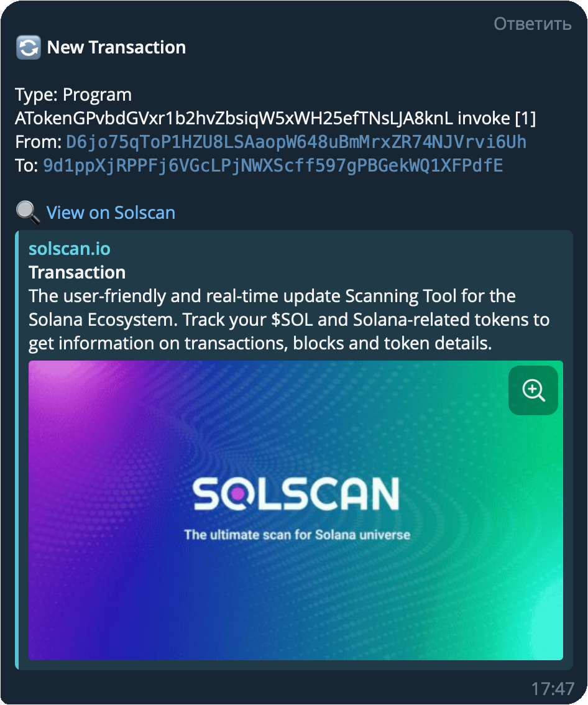

<a id="readme-top"></a>
<div align="center">
  <a href="https://github.com/spam5041/Solana-Token-Monitor-Bot">
    
  </a>
  <h3 align="center">Solana Token Monitor Bot</h3>

  <p align="center">
    Telegram бот для мониторинга создания новых токенов в сети Solana. Бот отслеживает создание токенов, собирает метаданные и позволяет управлять черным списком создателей токенов.
    <br />
    <br />
    ЭТО ТЕСТОВАЯ РЕАЛИЗАЦИЯ, за полной версией обращайтесь в <a href="https://t.me/boosterochek"><strong>телеграм</strong></a>
    <br />
  </p>
  


</div>



## Функциональность

- Мониторинг создания новых токенов в сети Solana
- Сбор и отображение метаданных токенов:
- Название и символ токена
- Общее предложение (Total Supply)
- Mint адрес
- Адрес создателя
- Социальные ссылки (если доступны)
- Управление черным списком создателей токенов
- Мониторинг транзакций выбранных токенов
- Интеграция с Solscan для просмотра деталей

## Требования

- Node.js v16+
- Redis
- Telegram Bot Token
- Solana RPC URL

## Установка

1. Клонируйте репозиторий:

 ```sh
git clone https://github.com/spam5041/Solana-Token-Monitor-Bot
cd solana-token-monitor-bot
```

2. Установите зависимости:

 ```sh
npm install
```


3. Переименуйте файл `.env.example` в `.env` и заполните необходимые переменные:

```sh

TELEGRAM_BOT_TOKEN=your_telegram_bot_token
TELEGRAM_GROUP_ID=your_telegram_group_id

SOLANA_RPC_URL=https://api.devnet.solana.com

REDIS_URL=redis://localhost:6379
```

4. Скомпилируйте TypeScript:

```sh
npm run build
```

5. Запустите бот:

```sh
npm start
```


## Команды бота

- `/help` - Показать список доступных команд
- `/blacklist` - Показать черный список адресов
- `/unblacklist <address>` - Удалить адрес из черного списка
- `/test` - Проверить подключение к Solana и Redis
